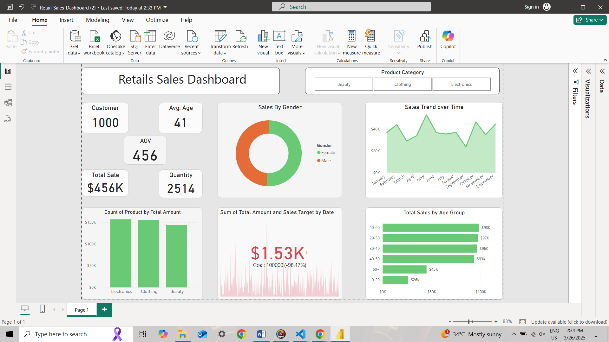

# 🛍️ Retail Sales Dashboard

A **Power BI dashboard** for analyzing **retail sales trends, customer behavior, and product performance**.

## 📌 About the Project

This **Retail Sales Dashboard** provides an in-depth analysis of:
- **Sales performance** 📊
- **Customer demographics** 👥
- **Product category trends** 🏷️  

It helps **retail businesses** track key metrics and optimize strategies.

---

## 📈 Key Insights & Features  
✔️ **Total Customers**: 1,000 🧑‍🤝‍🧑  
✔️ **Average Order Value (AOV)**: $456 💰  
✔️ **Total Sales Revenue**: $456K 🏆  
✔️ **Total Quantity Sold**: 2,514 📦  
✔️ **Sales by Gender**: Male 🟠 | Female 🟣  
✔️ **Sales Trend Over Time**: Monthly revenue fluctuations 📉  
✔️ **Top-Selling Product Categories**: Electronics, Clothing, Beauty 🏅  
✔️ **Sales by Age Group**: Customer segmentation by age bracket 🎯  
✔️ **Sales Target Tracking**: Actual vs Target revenue 🚀  

---

## 🛠 Tech Stack Used  
🔹 **Power BI** – Dashboard creation & visualization  
🔹 **Python** (Pandas, Matplotlib, Seaborn) – Data preprocessing & analysis  
🔹 **SQL** – Querying structured data  
🔹 **Excel** – Initial data cleaning  

Explore the interactive dashboard

📬 Contact
📧 Email: rahul8418sharma@gmail.com
💼 LinkedIn: https://www.linkedin.com/in/rahulsharma4410 

